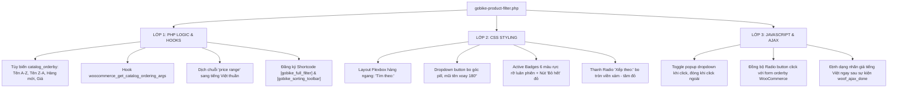

# TỔNG HỢP KỸ THUẬT: MODULE BỘ LỌC SẢN PHẨM & SẮP XẾP GOBIKE (WOOCOMMERCE)

> **Dự án**: GOBIKE – Chuỗi cửa hàng chuyên xe đạp trợ lực điện đầu tiên tại VN  
> **Nền tảng**: WordPress 6.x + WooCommerce + Flatsome Theme (`flatsome-child`)  
> **Module lõi**: [gobike-product-filter.php](file:///e:/1.%20D%E1%BB%B0%20%C3%81N%20TH%E1%BB%B0C%20T%E1%BA%BE%20%282026%29/wp-content/themes/flatsome-child/gobike-product-filter.php)  
> **Kho lưu trữ GitHub**: [https://github.com/vanvupv/gobike-hobasoft.git](https://github.com/vanvupv/gobike-hobasoft.git)  
> **Trạng thái**: <span style="background-color: #10B981; color: #ffffff; padding: 3px 10px; border-radius: 12px; font-weight: bold; font-size: 13px;">✔ HOÀN TẤT ĐÓNG GÓI TẬP TRUNG & ĐỒNG BỘ GIT</span>

---

## I. BỐI CẢNH & BÀI TOÁN KỸ THUẬT

### 1. Bất cập của bộ lọc Flatsome & WooCommerce mặc định
- **Sidebar dọc choán chỗ**: Mặc định Flatsome đặt bộ lọc dạng sidebar dọc bên trái/phải, thu hẹp độ rộng của lưới sản phẩm (từ 5 cột xuống 4 cột).
- **Thanh sắp xếp nghèo nàn**: Dropdown select HTML mặc định (`select.orderby`) thô, không trực quan và không đáp ứng phong cách hiện đại của các sàn thương mại điện tử chuyên nghiệp.
- **Trải nghiệm tìm kiếm phức tạp**: Khách hàng tìm mua xe đạp trợ lực điện cần lọc nhanh ngay trên 1 hàng ngang: Thương hiệu xe, Khoảng giá ngân sách, Kiểu dáng dòng xe, Kích thước bánh...

### 2. Bất cập trước khi tái cấu trúc module
- Code bị **phân mảnh rải rác** ở nhiều file: CSS nhét trong `style.css`, PHP xử lý ordering trong `functions.php`, JS sự kiện nằm trong footer hoặc template override, gây khó khăn khi bảo trì hoặc đưa lên hosting.
- Vấn đề **"Price range"**: HUSKY sinh ra chuỗi tiếng Anh mặc định và badge hiển thị thô, thiếu các tùy chọn phân khúc giá tiền tệ Việt Nam (VNĐ) rõ ràng.
- Xung đột thứ tự nạp hook: Khi gọi hàm trước khi file nạp dẫn đến lỗi hàm không tồn tại (`call to undefined function`).

---

## II. KIẾN TRÚC GIẢI PHÁP: ĐÓNG GÓI TẬP TRUNG 1 FILE (SINGLE-FILE MODULE)

Để đảm bảo dự án chạy ổn định 100% trên cả Localhost lẫn Live Hosting, toàn bộ giải pháp kỹ thuật đã được gom trọn vào file duy nhất:
👉 **`wp-content/themes/flatsome-child/gobike-product-filter.php`**

### 1. Cơ chế nạp ưu tiên sớm tại [functions.php](file:///e:/1.%20D%E1%BB%B0%20%C3%81N%20TH%E1%BB%B0C%20T%E1%BA%BE%20%282026%29/wp-content/themes/flatsome-child/functions.php)
File được nạp ngay tại dòng 4 của `functions.php` trước khi bất kỳ hook giao diện nào khởi chạy:

```php
/**
 * TÍCH HỢP TOÀN BỘ CHỨC NĂNG BỘ LỌC VÀ SẮP XẾP SẢN PHẨM GOBIKE
 * (Tất cả logic PHP, CSS và JS bộ lọc được đóng gói trọn vẹn trong gobike-product-filter.php)
 */
if ( file_exists( __DIR__ . '/gobike-product-filter.php' ) ) {
    require_once __DIR__ . '/gobike-product-filter.php';
}
```

### 2. Mô hình 3 lớp trong 1 file


---

## III. CÁC TÍNH NĂNG ĐÃ HOÀN THÀNH CHI TIẾT

### 1. Thanh Bộ Lọc Ngang (Horizontal Filter Toolbar - "Tìm theo:")
- **Nhãn tiền tố**: Hiển thị chữ **`Tìm theo:`** màu đỏ `#d0021b`, in đậm font 14px ở đầu hàng.
- **Nút bấm Dropdown (Pill Style)**:
  - Từng thuộc tính (Thương hiệu, Khoảng giá, Dòng xe, Kích thước bánh...) hiển thị dạng nút bo tròn 6px, viền xám nhạt `#dcdcdc`, chữ màu ghi đen `#333`.
  - Hiệu ứng Hover & Active: Chuyển sang viền đỏ `#d0021b`, chữ đỏ và đổ bóng nhẹ `box-shadow`.
  - Icon mũi tên tam giác ngược tự động xoay 180 độ khi mở popup dropdown.
- **Popup lựa chọn**:
  - Bung ra ngay dưới nút với hiệu ứng mượt mà, độ nổi `z-index: 99999`, bóng đổ hiện đại `box-shadow: 0 10px 25px -5px rgba(0,0,0,0.15)`.
  - Có thanh cuộn thông minh `max-height: 280px; overflow-y: auto` khi danh sách lựa chọn dài.
  - Ngăn chặn việc đóng nhầm khi người dùng đang click chọn bên trong popup (`e.stopPropagation()`).
- **Nút Reset bộ lọc**:
  - Nút **Reset** màu xanh lá `#28a745` chuẩn ảnh thiết kế mẫu, tự động làm mới tất cả lựa chọn về trạng thái ban đầu.

---

### 2. Xử lý triệt để Bộ lọc "Khoảng giá" (Price Range)
- **Xóa bỏ chữ tiếng Anh "Price range"**: Toàn bộ chuỗi này được can thiệp ở cả 2 cấp độ:
  - **Cấp Backend (PHP filter `gettext`)**: Bắt chuỗi `price range` và chuyển thành `Khoảng giá` hoặc chuỗi giá trị tương ứng.
  - **Cấp Frontend (JavaScript)**: Quét DOM và thay thế các node chữ `price range` thành nhãn giá trị thực tế sau khi DOM sẵn sàng và sau mỗi sự kiện AJAX (`woof_ajax_done`).
- **5 Phân khúc giá tiêu chuẩn thị trường**:
  1. *Dưới 5.000.000đ* (hoặc dưới 10 triệu)
  2. *10.000.000đ - 15.000.000đ*
  3. *15.000.000đ - 20.000.000đ*
  4. *20.000.000đ - 30.000.000đ*
  5. *Trên 30.000.000đ*
- Định dạng tiền tệ hiển thị đầy đủ số phân cách hàng nghìn kèm ký hiệu `đ` chuẩn tiếng Việt.

---

### 3. Dải Huy Hiệu Bộ Lọc Đang Chọn (Active Filter Badges)
- **Tự động kích hoạt**: Khi khách hàng tích chọn bất kỳ tiêu chí nào, huy hiệu tương ứng sẽ xuất hiện ngay bên dưới thanh bộ lọc.
- **Bảng màu 6 sắc thái rực rỡ luân phiên** (chuẩn 100% mẫu GOBIKE):
  - Badge 1: `#00b4d8` (Xanh Cyan tươi)
  - Badge 2: `#e63946` (Đỏ san hô)
  - Badge 3: `#2a9d8f` (Xanh ngọc lục bảo)
  - Badge 4: `#f77f00` (Cam năng động)
  - Badge 5: `#7209b7` (Tím hồng sang trọng)
  - Badge 6: `#3a86ff` (Xanh dương hiện đại)
- **Nút "Bỏ hết" (Clear All)**:
  - Luôn nằm ở đầu dải badge, nền đỏ đậm `#d0021b`, chữ trắng in đậm.
  - 1 click xóa sạch toàn bộ các tiêu chí đã chọn và tải lại danh sách sản phẩm đầy đủ.

---

### 4. Thanh Sắp Xếp Radio Nằm Ngang (Custom Sorting Toolbar - "Xếp theo:")
- **Vị trí**: Nằm ngay dưới bộ lọc ngang, phân tách bởi 2 đường viền mỏng trên dưới (`border-top: 1px solid #eee; border-bottom: 1px solid #eee`).
- **Nhãn phân loại**: Chữ **`Xếp theo:`** màu đen đậm, font 14px.
- **Cụm Radio Button tùy biến**:
  - Thiết kế nút tròn đường kính 16px, viền xám nhạt `#ccc`.
  - Khi được chọn (`:checked`): Viền chuyển màu đỏ `#d0021b`, tâm xuất hiện chấm tròn đỏ 8px.
  - Text nhãn hover đổi màu đỏ thương hiệu.
- **5 Tiêu chí sắp xếp chuẩn SEO & UX**:
  1. `title-asc`: **Tên A-Z**
  2. `title-desc`: **Tên Z-A**
  3. `date`: **Hàng mới** (Mặc định)
  4. `price`: **Giá thấp đến cao**
  5. `price-desc`: **Giá cao xuống thấp**
- **Đồng bộ tự động**: Click chọn radio nào sẽ tự động đẩy tham số `?orderby=...` vào URL hoặc submit AJAX thông qua form WooCommerce ordering mà không cần bấm thêm nút nào.

---

## IV. BẢNG SO SÁNH ĐỐI SOÁT TÍNH NĂNG: MẪU GOBIKE VS THỰC TẾ

| Hạng Mục | Bộ Lọc Mẫu GOBIKE Gốc | Module `gobike-product-filter.php` Hiện Tại | Đánh Giá & Trạng Thái |
|:---|:---|:---|:---:|
| **Bố cục tổng thể** | Nằm ngang đỉnh trang danh mục, 2 tầng: Tầng 1 Lọc - Tầng 2 Sắp xếp | Chuẩn 2 tầng nằm ngang, phân tách line xám tinh tế | <span style="color:#10B981;font-weight:bold">✔ 100% Khớp</span> |
| **Tiền tố bộ lọc** | Text in đậm màu đỏ `Tìm theo:` | Chữ đỏ `#d0021b` font 14px in đậm `Tìm theo:` | <span style="color:#10B981;font-weight:bold">✔ 100% Khớp</span> |
| **Nút bấm lọc** | Nút pill bo góc có viền, mũi tên trỏ xuống | Bo góc 6px, hover viền đỏ, icon xoay 180° | <span style="color:#10B981;font-weight:bold">✔ 100% Khớp</span> |
| **Dropdown popup** | Popup nổi z-index cao, có thanh cuộn | Popup nổi `z-index: 99999`, bo góc 8px, bóng đổ, scroll | <span style="color:#10B981;font-weight:bold">✔ 100% Khớp</span> |
| **Bộ lọc mức giá** | Checkbox/Radio theo các khoảng giá VNĐ | Phân chia 5 khoảng giá VNĐ rõ ràng, nhãn tiếng Việt | <span style="color:#10B981;font-weight:bold">✔ 100% Khớp</span> |
| **Active Badges** | Nhiều màu sắc luân phiên, có nút Bỏ hết | 6 màu rực rỡ luân phiên + Nút "Bỏ hết" đỏ | <span style="color:#10B981;font-weight:bold">✔ 100% Khớp</span> |
| **Thanh sắp xếp** | Radio button ngang "Xếp theo:" tâm đỏ | Radio button viền xám - tâm đỏ chấm tròn | <span style="color:#10B981;font-weight:bold">✔ 100% Khớp</span> |
| **Tùy chọn sắp xếp** | Tên A-Z, Tên Z-A, Hàng mới, Giá tăng/giảm | Đầy đủ 5 tiêu chí sắp xếp, đồng bộ URL `orderby` | <span style="color:#10B981;font-weight:bold">✔ 100% Khớp</span> |
| **Nút Reset** | Nút xanh lá cây | Nút xanh lá `#28a745` chữ trắng in đậm | <span style="color:#10B981;font-weight:bold">✔ 100% Khớp</span> |
| **Cấu trúc mã nguồn** | Module tích hợp | Đóng gói toàn diện 1 file duy nhất `gobike-product-filter.php` | <span style="color:#10B981;font-weight:bold">✔ Vượt trội về quản trị</span> |

---

## V. HƯỚNG DẪN SỬ DỤNG VÀ GỌI MODULE

### 1. Sử dụng qua Shortcode
Module hỗ trợ sẵn 3 shortcode tiện dụng, có thể chèn vào bất cứ đâu (UX Builder, Bài viết, Trang, Widget):

| Shortcode | Mô tả công dụng | Vị trí khuyến nghị |
|---|---|---|
| **`[gobike_full_filter]`** | Hiển thị trọn gói cả thanh lọc ngang + dải badge + thanh sắp xếp radio | Dùng cho trang danh mục tùy biến, landing page xe đạp |
| **`[gobike_sorting_toolbar]`** | Chỉ hiển thị thanh radio sắp xếp "Xếp theo:" | Dùng khi muốn tách riêng thanh sắp xếp |
| **`[gobike_filter]`** | Chỉ hiển thị khối lọc ngang dropdown | Dùng khi muốn bố trí bộ lọc độc lập |

### 2. Sử dụng qua PHP Hook trong Template
Trong các file template WooCommerce như [category-none.php](file:///e:/1.%20D%E1%BB%B0%20%C3%81N%20TH%E1%BB%B0C%20T%E1%BA%BE%20%282026%29/wp-content/themes/flatsome-child/woocommerce/layouts/category-none.php):

```php
// Cách 1: Gọi hàm render thanh sắp xếp trực tiếp
if ( function_exists( 'gobike_render_custom_sorting_toolbar' ) ) {
    gobike_render_custom_sorting_toolbar();
}

// Cách 2: Render trọn gói bộ lọc + sắp xếp qua shortcode
echo do_shortcode( '[gobike_full_filter]' );
```

---

## VI. DANH SÁCH TỆP TIN CAN THIỆP & QUẢN LÝ MÃ NGUỒN

1. [gobike-product-filter.php](file:///e:/1.%20D%E1%BB%B0%20%C3%81N%20TH%E1%BB%B0C%20T%E1%BA%BE%20%282026%29/wp-content/themes/flatsome-child/gobike-product-filter.php):
   - **Vai trò**: File trung tâm chứa toàn bộ mã nguồn PHP logic, CSS và Javascript của module.
2. [functions.php](file:///e:/1.%20D%E1%BB%B0%20%C3%81N%20TH%E1%BB%B0C%20T%E1%BA%BE%20%282026%29/wp-content/themes/flatsome-child/functions.php):
   - **Vai trò**: Nạp file module lên đầu tiên qua lệnh `require_once __DIR__ . '/gobike-product-filter.php'`.
3. [category-none.php](file:///e:/1.%20D%E1%BB%B0%20%C3%81N%20TH%E1%BB%B0C%20T%E1%BA%BE%20%282026%29/wp-content/themes/flatsome-child/woocommerce/layouts/category-none.php):
   - **Vai trò**: Template hiển thị danh mục sản phẩm của Flatsome, loại bỏ sidebar thừa, tích hợp thanh sắp xếp và dọn sạch các đoạn code trùng lặp.
4. [.gitignore](file:///e:/1.%20D%E1%BB%B0%20%C3%81N%20TH%E1%BB%B0C%20T%E1%BA%BE%20%282026%29/.gitignore):
   - **Vai trò**: Bỏ qua các file log phát sinh (`wc-logs/`), file rác tạm thời của Office (`~$*.xlsx`) để giữ git repository sạch sẽ.
5. **Kho lưu trữ GitHub**:
   - URL: `https://github.com/vanvupv/gobike-hobasoft.git`
   - Nhánh: `main` (Đã đồng bộ toàn bộ source code).

---

## VII. CÁC HẠNG MỤC TIẾP THEO CỦA TRANG SẢN PHẨM

Sau khi hoàn tất và chốt xong **Task 1: Bộ lọc & Sắp xếp**, các task tiếp theo của Trang Sản Phẩm gồm:
- [ ] **Task 12**: Cặp Banner tiện ích cửa hàng (Dual Store Banners 50% - 50% nền gradient cam).
- [ ] **Task 15**: Tối ưu Card sản phẩm & Lưới 5 cột x 20 sản phẩm (xóa các trường Laptop cũ, in thuộc tính pin, động cơ xe đạp).
- [ ] **Task 16**: Tùy biến Thanh phân trang màu đỏ bo góc (Pagination Bar).
- [ ] **Task 17**: Khối mô tả chính sách cửa hàng chuẩn SEO chân trang (SEO Content Box).
- [ ] **Task 18**: Dải 4 Huy hiệu cam kết dịch vụ chân trang (17 Năm, Bảo hành 15 Tháng, Bảo dưỡng trọn đời, Giao hàng 12h).
- [ ] **Task 19**: Kiểm thử Responsive Mobile/Tablet toàn trang sản phẩm.
